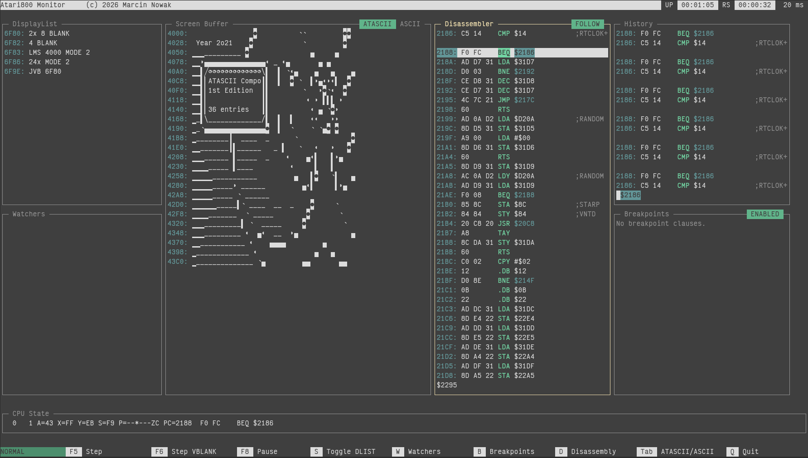

# a800mon



`a800mon` is a terminal monitor/debugger for Atari800, available in two variants:
- Python: `py800mon`
- Go: `go800mon`

## Required Emulator

This tool requires an Atari800 build/fork with the socket server enabled (RPC over UNIX socket).

Atari800 fork repository: https://github.com/a800mon/atari800

The fork provides socket server, which can be enabled by `-socket`
option:

```bash
atari800 -socket /tmp/atari.sock
```

It also provides two experimental debug-oriented options:
- `-live-monitor`
- `-live-monitor-audio`

These options make debugging easier, but may be unstable. For backward compatibility, they are disabled by default.

For the best experience run the emulator with these options:

```bash
atari800 -socket /tmp/atari.sock -live-monitor -live-monitor-audio
```

NOTE: Default socket path is `/tmp/atari.sock`, but the fork still requires `-socket <path>` to enable the socket server.

## Install / Build

### Python (`py800mon`)

```bash
pip install --user -e .
```

### Go (`go800mon`)

```bash
go install ./go800mon/cmd/go800mon/
```

If `go800mon` is not visible in your shell, add `$(go env GOPATH)/bin` to `PATH` or set:

```bash
go env -w GOBIN="$HOME/.local/bin"
```

## Usage

Run the monitor:

```bash
py800mon
```

or

```bash
go800mon
```

### Command Line Options

Check for available options with:

```bash
py800mon --help
```

or

```bash
go800mon --help
```
